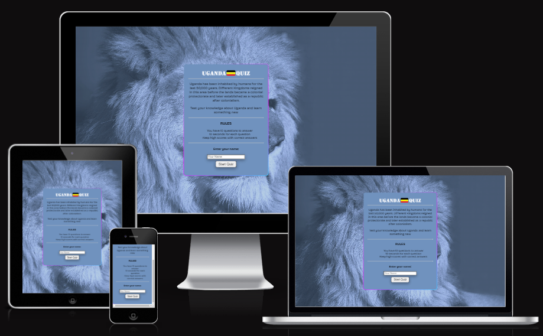
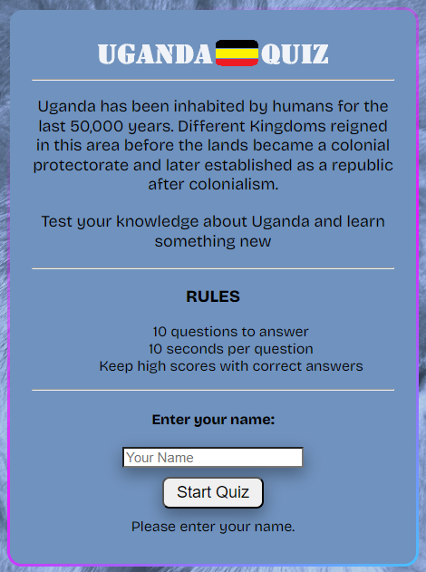
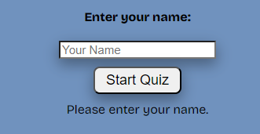
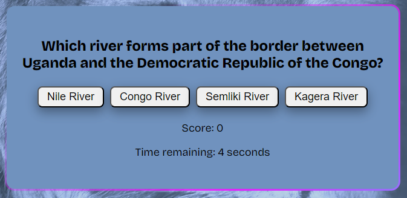
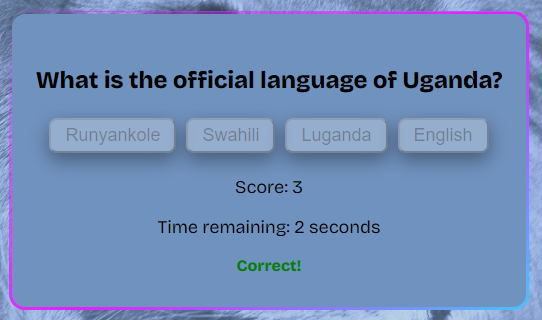
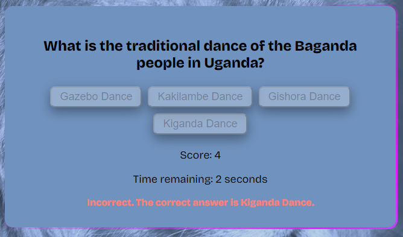
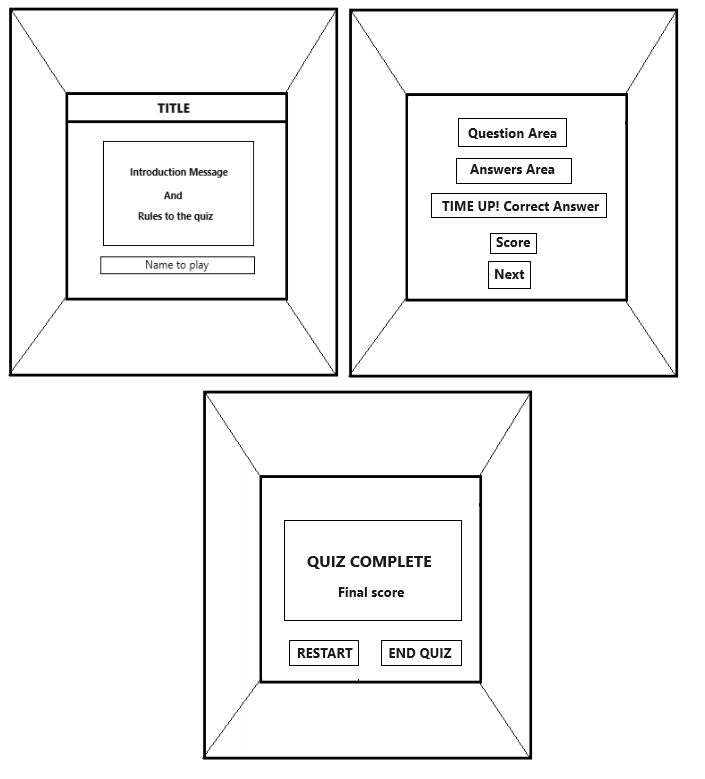
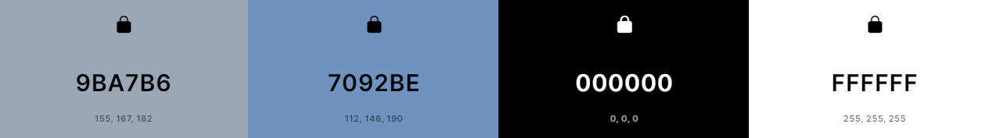
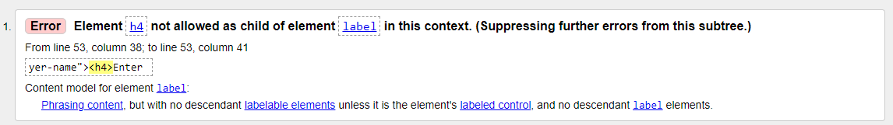
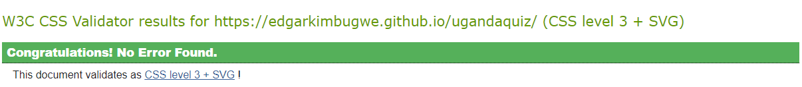

---

# Quiz for Uganda

## An exciting journey through the rich and diverse tapestry of Uganda!

Embark on an enlightening adventure that will test your knowledge of Uganda's history, culture, geography, and more. Whether you're a seasoned Uganda enthusiast or a curious explorer eager to learn, this quiz game promises an engaging experience filled with fascinating facts and surprising insights.
 
View the live site [here](https://edgarkimbugwe.github.io/quiz4uganda/)

# Table of content

- [FEATURES](#features)
  - [Home Page](#home-page)
    - [Title with Favicon](#title-with-favicon)
    - [Header](#header)
    - [Main Content of the game / Start Screen](#main-content-of-the-game--start-screen)
    - [Quiz Display Screen](#quiz-display-screen)
    - [Correct Answer](#correct-answer)
    - [Wrong Answer](#wrong-answer)
    - [End Page](#end-page)
  - [FUTURE FEATURES](#future-features)
- [DESIGN](#design)
  - [Wireframe](#wireframe)
  - [Color Palette](#color-palette)
  - [Typography](#typography)
  - [Images](#images)
- [TECHNOLOGIES APPLIED](#technologies-applied)
- [USER EXPERIENCE](#user-experience)
  - [Project goal](#project-goal)
  - [User Stories](#user-stories)
- [TESTING](#testing)
    - [Wave Web Accessibility](#wave-web-accessibility)
  - [Responsiveness](#responsiveness)
  - [Coding](#coding)
    - [HTML](#html)
    - [CSS](#css)
    - [JAVASCRIPT](#javascript)
  - [Lighthouse Test](#lighthouse-test)
- [DEPLOYMENT](#deployment)
    - [Deployment to GitHub Pages](#deployment-to-github-pages)
- [CREDIT/ACKNOWLEDGEMENT](#creditacknowledgement)
  - [Acknowledge-Code](#acknowledge-code)

---

# FEATURES

## Home Page

### Title with Favicon

Part of he game logo (flag of Uganda) will be incorporated as a favicon, serving as a distinctive visual identity. This will display as an image in the title header of the tab, aiding users in quickly recognizing the website, especially when they have multiple tabs open.

### Header

A logo is displayed in the header of the webpage.

### Main Content of the game / Start Screen

- This segment encompasses essential details about the website, highlighting what users can anticipate from their browsing experience of the quiz challenge.
- Users are given brief rules on how to go about the quiz challenge.
- Users can then input their name/s inorder to continue to the quiz area by clicking onto the <strong>'Start Quiz'</strong> button.

However as the player tries to click <strong>'Start Quiz'</strong> without entering a name, a pop up message below will alert him/her to enter the name.

### Quiz Display Screen

- A question is displayes with four options for the player to choose from.
- A timer displays a countdown of 10 seconds for the player to answer a question.
- 10 questions in total are shuffled in this area until the player answers all the questions.

### Correct Answer

- When the player answers correctly, a message ('correct') is displayed in green.
  

### Wrong Answer

- Likewise when the player selects a wrong answer, a display message with a correct answer ('Incorrect....") displays in Salmon color.
  

### End Page

- On this page, the player is alerted that the game complete.
- The player's name is retrieve with a message of the final score.
- The <strong>Restart Quiz</strong> button allows the player to restart the quiz again or <strong>END Quiz</strong> and return to the welcome page.
- Below, the player can choose to connect with the quiz' social media accounts.

  

## FUTURE FEATURES

- Improve in functionality of the feedback to developer by adding a message box.
- Add an option of playing the quiz with multiple players.
- Add questions and categorise them in different subjects with an option for the player/s to select the subject they want to take on the quiz.

---

# DESIGN

## Wireframe

The wireframes for this website were created using Microsoft Paint

## Color Palette

Colors for the website were created using [Coolors](https://coolors.co/)

## Typography

Bricolage Grotesque fonts were embeded into the html head element and also using CSS rules to specify the fonts families.

## Images

- The lion image was from [Pexels](https://www.pexels.com/).
- Logo was created by myself using Microsoft Paint

---

# TECHNOLOGIES APPLIED

- HTML: Used for setting up the structure of both the Homepage and Quiz game page.
  
- CSS: Used to style the home page and quiz game area.
  
- JavaScript: Used to design interactive buttons and elevate user engagement within the quiz
  
- GitHub: The source code resides on GitHub and is implemented using Git Pages for deployment.
  
- Git: Employed to commit and push code during various development phases of the website.
  
- Microsoft Paint: Used for crafting wireframes and the creation and modification of the logo.
  
- Google Fonts: Used to get fonts to give the website a visual appeal.

---

# USER EXPERIENCE

## Project goal

The "Uganda Quiz Challenge" seeks to offer an engaging educational experience, prompting users to explore Uganda's history, culture, and geography through captivating questions. It encourages friendly competition among enthusiasts and learners, celebrating Uganda's heritage and deepening understanding of its unique features. The ultimate aim is to unravel mysteries, showcase expertise, and create an enjoyable learning journey for participants.

## User Stories

- As a new user: I want a clear and user-friendly interface to easily navigate through and an introduction to understand the purpose and structure of the quiz.
- As a player: I want a variety of questions that cover different aspects of Uganda's history, culture, and geography and a timer for each question to add a sense of challenge and excitement.
- As a learner: I want the option to review my performance and see how many questions I answered correctly or incorrectly.
- As a competitive user: I want a scoring system to track and compare my performance.
- As an explorer: I want a diverse set of questions that cover lesser-known aspects of Uganda to broaden my understanding.
- As a repeat player: I want a randomization feature to ensure a fresh experience each time I play.
- As a mobile user: I want the quiz to be accessible and optimized for different devices, including smartphones and tablets.
- As a curious mind: I want links or references to additional resources for further reading on Uganda's history, culture, and geography.

---

# TESTING

### Wave Web Accessibility

- Was used to test the page for errors and after running the page intothe too, no errors were detected. Also no color contrast errors were detected in the page.

## Responsiveness

With the aid of Chrome DevTools, the website exhibited optimal performance during comprehensive responsiveness testing on small, medium, and large screens across different devices. The website passed the responsiveness test successfully, with no observed issues on the trial devices employed.

- iPhone 15
- Samsung Galaxy S20
- Apple ipad Pro

## Coding

The website has been thoroughly tested. All the code has been run through the W3C HTML Validator, W3C CSS Validator and the JS Hint. Some errors were initially detected and fixed.

### HTML

When the page was run for html testing, an error below was detected.

After fixing the error, the website was checked again and no errors were detected.

### CSS

### JAVASCRIPT

Testing was carried out by [JSHint](https://jshint.com/) and 39 warnings were detected. They however do not affect the functioning of the quiz game.

## Lighthouse Test

The site was also tested using the lighthouse option built in chrome's Dev Tools and the results were satisfying.

---

# DEPLOYMENT

The subsequent Git commands were employed during the development process to push code to the remote repository:

`git add .` - To add all updated file(s) to the staging area.

`git commit -m “commit message”` - T commit changes from the staging area to the local repository

`git push` - To safely secure all committed code to the remote repository on Git Hub.

### Deployment to GitHub Pages

The site was deployed to GitHub pages. The steps to deploy are as follows:

1. In the GitHub repository, navigate to the Settings tab

2. From the menu on left select 'Pages'

3. From the source section drop-down menu, select the Branch: main

4. Click 'Save'

5. A live link will be displayed in blue when published successfully.

The Live link can be access by clicking on the blue link here [Quiz4Uganda](https://edgarkimbugwe.github.io/quiz4uganda/)

# CREDIT/ACKNOWLEDGEMENT

## Acknowledge-Code

The majority of the JavaScript code was derived from a YouTube video and then customized. You can find the original code in the following link: [Coding Artist](https://www.youtube.com/watch?v=p-2G-7vLuV4&t=2286s)

Also, I would like to express my gratitude to my mentor, Spencer Barriball, for dedicating her time and efforts to support and guide me.
